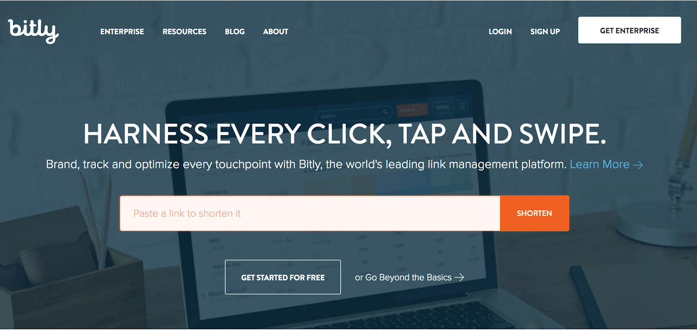
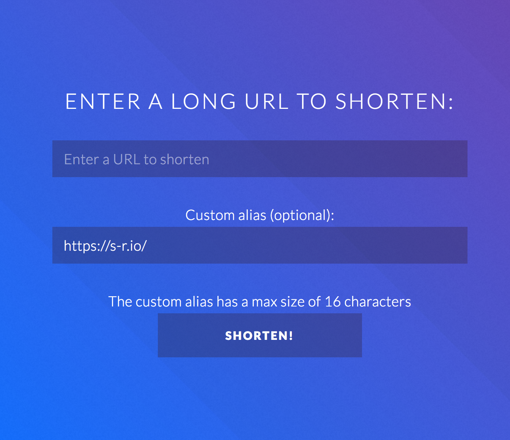

# **Software Requirements Specification** : Mangler

Mangler - Solomon Rubin

----

 <h1> Mangler / Manglr </h1>

<h2>Software Requirements Specification</h2>

<h3> Version: 0.0.1-Dev</h3>

> <h3>Solomon Rubin</h3> <h4>Lead Software Engineer<h4>

----

## **Revision History**

| Date | Description    | Author | Comments |
| ---- | -------------- | -------- | ------------- |
| 1.24.18 | On Going initial document development | Solomon Rubin| On going           |

## **Document Approval**

The following Software Requirements Specification has been accepted and approved by the following:
| Signature | Printed Name | Title | Date|
|-----------|--------------|-------|-----|
| ...       | Solomon Rubin | Working Document Approval    |  4.10.18   |

**Acknowledgements:**

Sections of this document are based upon the IEEE Guide to Software Requirements Specification (ANSI/IEEE Std. 830-1984).  The SRS document was designed by Dr. Orest Pilskalns (WSU, Vancover) and Jack Hagemeister (WSU, Pullman).

----
					

**Table of Contents**
<!-- generated with markdown-toc -->
<!-- toc -->

* [1. **Introduction**](#1-introduction)
  * [1.1 **Purpose**](#11-purpose)
  * [1.2 **Scope**](#12-scope)
  * [1.3 **Definitions, Acronyms, and Abbreviations**](#13-definitions-acronyms-and-abbreviations)
  * [1.4 **References**](#14-references)
  * [1.5 **Overview**](#15-overview)
* [2. **General Description**](#2-general-description)
  * [2.1 **Product Perspective**](#21-product-perspective)
  * [2.2 **Product Functions**](#22-product-functions)
  * [2.3 **User Characteristics**](#23-user-characteristics)
  * [2.4 **General Constraints**](#24-general-constraints)
  * [2.5 **Assumptions and Dependencies**](#25-assumptions-and-dependencies)
* [3. **Specific Requirements**](#3-specific-requirements)
  * [3.1 **External Interface Requirements**](#31-external-interface-requirements)
    * [3.1.1 **User Interfaces**](#311-user-interfaces)
    * [3.1.2 **Hardware Interfaces**](#312-hardware-interfaces)
    * [3.1.3 **Software Interfaces**](#313-software-interfaces)
      * [3.1.3.1 **Hard Requirements**](#3131-hard-requirements)
      * [3.1.3.2 **Soft Requirements**](#3132-soft-requirements)
  * [3.2 **Functional Requirements**](#32-functional-requirements)
    * [3.2.1 **URL Backend**](#321-url-backend)
    * [3.2.2 **User-Interface**](#322-user-interface)
      * [3.2.2.2 **General Requirements**](#3222-general-requirements)
  * [3.3 **Use Cases**](#33-use-cases)
    * [3.3.1 **Use Case #1**](#331-use-case-%231)
    * [3.3.2 **Use Case #2**](#332-use-case-%232)
  * [3.4 **Classes / Objects**](#34-classes--objects)
    * [3.4.1 ****](#341-)
    * [3.4.2 ****](#342-)
  * [3.5 **Non-Functional Requirements**](#35-non-functional-requirements)
    * [3.5.1 **Performance**](#351-performance)
    * [3.5.2 **Reliability**](#352-reliability)
    * [3.5.3 **Availability**](#353-availability)
    * [3.5.4 **Security**](#354-security)
    * [3.5.5 **Maintainability**](#355-maintainability)
    * [3.5.6 **Portability**](#356-portability)
  * [3.6 **Inverse Requirements**](#36-inverse-requirements)
  * [3.7 **Design Constraints**](#37-design-constraints)
  * [3.8 **Logical Database Requirements**](#38-logical-database-requirements)
  * [3.9 **Other Requirements**](#39-other-requirements)
* [4. **Analysis Models**](#4-analysis-models)
  * [4.1 **Sequence Diagrams**](#41-sequence-diagrams)
  * [4.3 **Data Flow Diagrams (DFD)**](#43-data-flow-diagrams-dfd)
  * [4.2 **State-Transition Diagrams (STD)**](#42-state-transition-diagrams-std)
* [5. **Change Management Process**](#5-change-management-process)
* [A. **Appendices**](#a-appendices)
  * [A.1 **Appendix 1 - Figures**](#a1-appendix-1---figures)
  * [A.2 **Appendix 2**](#a2-appendix-2)

<!-- tocstop -->

----

## 1. **Introduction**

_This document is to specify the The introduction to the Software Requirement Specification (SRS) document should provide an overview of the complete SRS document.  While writing this document please remember that this document should contain all of the information needed by a software engineer to adequately design and implement the software product described by the requirements listed in this document.   (Note: the following subsection annotates are largely taken  from the IEEE Guide to SRS)._

### 1.1 **Purpose**

The purpose of this document is to create a modern, enterprise level, URL Shortener. This will explain the technical planning related to the development of Mangler.

### 1.2 **Scope**

_This subsection should:_

    _(1)	 Identify the software product(s) to be produced by name; for example, Host DBMS, Report Generator, etc_

    _(2)	Explain what the software product(s) will, and, if necessary, will not do_

    _(3)	Describe the application of the software being specified. As a portion of this, it should:_

    _(a) Describe all relevant benefits, objectives, and goals as precisely as possible. For example, to say that one goal is to provide effective reporting capabilities is not as good as saying parameter-driven, user-definable reports with a 2 h turnaround and on-line entry of user parameters._

    _(b) Be consistent with similar statements in higher-level specifications (for example, the System Requirement Specification) , if they exist.What is the scope of this software product._

### 1.3 **Definitions, Acronyms, and Abbreviations**

This subsections provide the definitions of all terms, acronyms, and abbreviations required to properly interpret this document.

*   id - (url id) a primary id to identify the url, denoted in url by `<domain>/3d7sd8`
*   alias - (url alias) a secondary short 'id', generally custom, such as `<domain>/my-alias`

### 1.4 **References**

_This subsection should:_

    _(1)	Provide a complete list of all documents referenced elsewhere in the SRS, or in a separate, specified document._

    _(2)	Identify each document by title, report number - if applicable - date, and publishing organization._

    _(3)	Specify the sources from which the references can be obtained. _

_This information may be provided by reference to an appendix or to another document._

### 1.5 **Overview**

_This subsection should:_

    _(1) Describe what the rest of the SRS contains_

    _(2) Explain how the SRS is organized._

## 2. **General Description**

Mangler will be a URL shortener with "advanced" features to enable it to be competitive among other current URL shorteners on the market. Mangler will also be Free and Open Source which will give an additional edge in an era of tracking and data collection. 

Mangler will offer "advanced" features such as aliasing of URLS, per-url/per-alias analytics (that maintain privacy), URL blacklisting, and others. Mangler will function within a set of Micro-services to maintain a scalable and easily deployable solution.

### 2.1 **Product Perspective**

Mangler will aim to provide similar features to major players within the URL Shortening market, such as bit.ly and goo.gl, while also maintaining privacy of all users (redirectees included). Mangler will be a Free and Open Source product that can be self-hosted and used for free. 

### 2.2 **Product Functions**

The primary function of Mangler is to shorten long URLs into shorter URLS by means of an internal URL tracking database. 

The secondary function of Mangler is to offer simple management of a users URL, with the ability to add or remove "aliases" as well as track those who shortened their URL with basic data analytics.

### 2.3 **User Characteristics**

Users will be split up into two groups: End Users and API Users, and Administrators. 

End Users:

    End users are defined to be users who only interact with the service through the web front end and thus are expected to interact with Mangler only via a browser. These users create the need for an intuitive and performant front end. There should be little to no learning curve and no prior knowledge will be expected to effectively use the service.

API Users:

    API users are defined as users who interact with Mangler primarily through the API interface, rather than a front-end interface. As such, the primary UI is considered an API User. 

Administrators:

    Administrators are defined as users who will not interface with the service, but rather configure and maintain it. Configuration and deployment should be flexible and simple to provide the easiest setup with the maximum amount of customizability. 

### 2.4 **General Constraints**

... 

### 2.5 **Assumptions and Dependencies**

...

## 3. **Specific Requirements**

The introduction to specific requirements will outline the microservice used to construct Mangler as a whole and describe details to their implementations as well as how they will interact with each other.

Microservices:
*   Authentication - OAuth server implementation.
*   URL Management interface - Manages URLs and URL aliases
*   URL Analytics Interface - Manages URL analytics processing
*   UI Interface - Manages serving the UI (also includes front end code)
*   API Gateway - Will act as a gateway to the api services and manage blocking unauthorized requests.

### 3.1 **External Interface Requirements**

#### 3.1.1 **User Interfaces**

#### 3.1.2 **Hardware Interfaces**
Mangler will be designed to be run on a standard Linux server as a standalone set of microservices resulting in the system as a whole. The application aims to be pretty light in terms of physical resources and will not take a significant amount of CPU cycles and RAM under _standard load_. Storage is considered a cheap resource and it's usage will rely entirely on the amount of users and number of database records.

#### 3.1.3 **Software Interfaces**
To enable scalability and easy customization the software requirements is designed with hard requirements and soft requirements.
##### 3.1.3.1 **Hard Requirements**
Mangler will have a firm requirement on Python3 as it is the core technology used. Also, initially the application will be reliant on MongoDB as the data storage solution. 
The application will have certain hard requirements on general technology specifications but does not necessarily require a specific implementation.  For example, Mangler will rely on OAuth2, but does not rely on a specific OAuth Software.
##### 3.1.3.2 **Soft Requirements**
Due to the microservice nature of the application design, it should be fairly simple to swap out certain solutions for compatible alternatives. 

For now, there are soft requirements on the following:

* OAuth2: authlib - both for server and client
*  HTTP Gateway: Nginx 

### 3.2 **Functional Requirements**

> _This section describes specific features of the software project.  If desired, some requirements may be specified in the use-case format and listed in the Use Cases Section._

#### 3.2.1 **URL Backend**

#####3.2.1.1 Introduction

#####3.2.1.2 Inputs

#####3.2.1.3 Processing

#####3.2.1.4 Outputs

#####3.2.1.5 Error Handling

#### 3.2.2 **User-Interface**
#####3.2.2.1 **Introduction**
User-interface will be treated as it's own "microservice" and house the serving mechanism as well as the actual user interface. Various user interfaces will be required to provide a front-end for critical functions as detailed below.

##### 3.2.2.2 **General Requirements**
*   Navigation
    *   Navigation should provide a minimal but informative way to navigate the service
    *   Navigation should include a means to navigate to the "home" or "shorten" page as well as URL management pages.
    *   Navigation should also indicate if a user is logged in and if so as who.
*   Home/Basic Shortener
    *   The home interface will primarily provide a quick method of shortening a URL. See figures 3.1 and 3.2 for examples
    *   The home interface should also provide a means to get more information about the service, such as custom defined text blocks and the github repo.
*   URL List/Management Home
*   URL Detail
*   URL Analytics
*   Account Management

### 3.3 **Use Cases**

#### 3.3.1 **Use Case #1**

#### 3.3.2 **Use Case #2**

…

### 3.4 **Classes / Objects**

#### 3.4.1 **<Class / Object #1>**

3.4.1.1 Attributes

3.4.1.2 Functions

<Reference to functional requirements and/or use cases>

#### 3.4.2 **<Class / Object #2>**

…

### 3.5 **Non-Functional Requirements**

_Non-functional requirements may exist for the following attributes.  Often these requirements must be achieved at a system-wide level rather than at a unit level.  State the requirements in the following sections in measurable terms (e.g., 95% of transaction shall be processed in less than a second, system downtime may not exceed 1 minute per day, > 30 day MTBF value, etc). _

#### 3.5.1 **Performance**

#### 3.5.2 **Reliability**

#### 3.5.3 **Availability**

#### 3.5.4 **Security**

#### 3.5.5 **Maintainability**

#### 3.5.6 **Portability**

### 3.6 **Inverse Requirements**

_State any *useful* inverse requirements._

### 3.7 **Design Constraints**

_Specify design constrains imposed by other standards, company policies, hardware limitation, etc. that will impact this software project._

### 3.8 **Logical Database Requirements**

_Will a database be used?  If so, what logical requirements exist for data formats, storage capabilities, data retention, data integrity, etc._

### 3.9 **Other Requirements**

_Catchall section for any additional requirements._

## 4. **Analysis Models**

_List all analysis models used in developing specific requirements previously given in this SRS.  Each model should include an introduction and a narrative description.  Furthermore, each model should be traceable the SRS's requirements._

### 4.1 **Sequence Diagrams**

### 4.3 **Data Flow Diagrams (DFD)**

### 4.2 **State-Transition Diagrams (STD)**

## 5. **Change Management Process**

_Identify and describe the process that will be used to update the SRS, as needed, when project scope or requirements change.  Who can submit changes and by what means, and how will these changes be approved._

## A. **Appendices**

_Appendices may be used to provide additional (and hopefully helpful) information.  If present, the SRS should explicitly state whether the information contained within an appendix is to be considered as a part of the SRS's overall set of requirements._

_Example Appendices could include (initial) conceptual documents for the software project, marketing materials, minutes of meetings with the customer(s), etc._

### A.1 **Appendix 1 - Figures**

3.1 - bit.ly home page. 

3.2 - s-r.io home page

### A.2 **Appendix 2**

